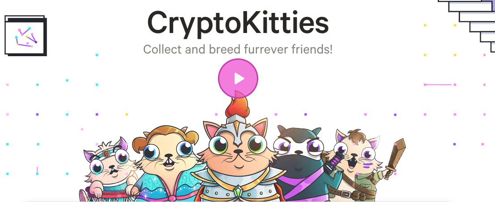
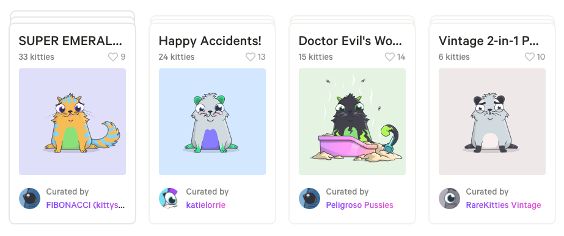

# CryptoKitties

CryptoKitties is a blockchain game on Ethereum developed by Axiom Zen that allows players to purchase, collect, breed and sell virtual cats. It is one of the earliest attempts to deploy blockchain technology for recreation and leisure. The game's popularity in December 2017 congested the Ethereum network, causing it to reach an all-time high in number of transactions and slowing it down significantly. 

### Background

CryptoKitties operates on Ethereum's underlying blockchain network, as a non-fungible token (NFT), unique to each CryptoKitty. Each CryptoKitty is unique and owned by the user, validated through the blockchain, and its value can appreciate or depreciate based on the market. CryptoKitties cannot be replicated and cannot be transferred without the user's permission even by the game developers. Users can interact with their CryptoKitties, having the ability to buy, sell, and sire (breed) them. However, the CryptoKitty art is not on the blockchain and is instead owned by Axiom Zen. The company released some of the art under a new 'Nifty' license that lets players use the image of their CryptoKitty in a limited way.

### Technology

A CryptoKitty's ownership is tracked via a smart contract on the Ethereum blockchain. Each CryptoKitty is represented as a non-fungible token using the ERC-721 token standard on Ethereum. Generation 0 CryptoKitties were sold to players in an auction at the rate of one every 15 minutes (672 per week) for one year. New CryptoKitties are created by breeding existing CryptoKitties.

## CryptoKitties and Blockchain
Shortly after launch, there were concerns that CryptoKitties was crowding out more serious, significant businesses that use the Ethereum platform. The game caused an increase in pending transactions on Ethereum, and at one point accounted for over 10% of network traffic on Ethereum.

According to some estimates, the game had 1.5 million users who were responsible for $40 million worth of transactions on its platform. Individual cryptokitties have sold for more than $300,000 a piece, some say. As of this writing, the average sale price for a cryptokitty was $65.76.

## CryptoKitties & Blockchain

* Based on the Ethereum blockchain technology, Ether is the only supported currency in this game. However, unlike Bitcoin, the Ethereum blockchain allows for smart contracts, or the ability to embed additional information along with the transaction. This allows ownership of these virtual cats to be transferred using the Ethereum blockchain.

* Shortly after the release of Cryptokitties, the backlog on the Ethereum blockchain
grew significantly and Cryptokitties has been blamed for a slowdown in the blockchain. 

* According to ETH Gas Station, the CryptoKitties game accounts for over 10% of network traffic on Ethereum. As traffic increases, transactions become more expensive to execute quickly.

* CryptoKitties lets players buy and breed "crypto-pets" on Ethereum's underlying blockchain network. CryptoKitties was a "key step" to making blockchains more accessible.