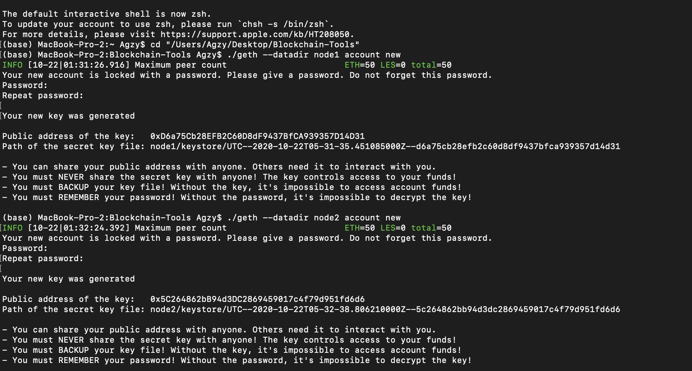
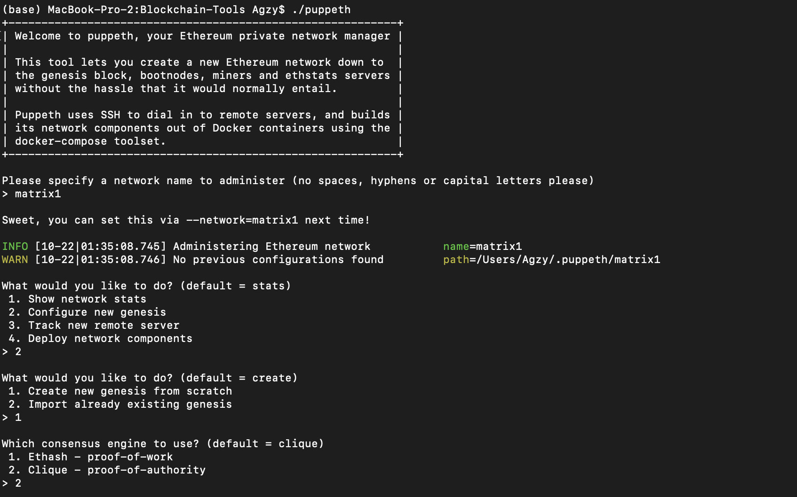

# Blockchain-Homework

Creating of Proof of Authority (PoA) algorithm required to create accounts for two nodes

* Once two nodes have been created, then we run the puppeth

* Chose the Clique - Proof of Authority consensus algorithm

* Copied the addresses for the new accounts created for two nodes

* Also, pre-fund both the accounts created

