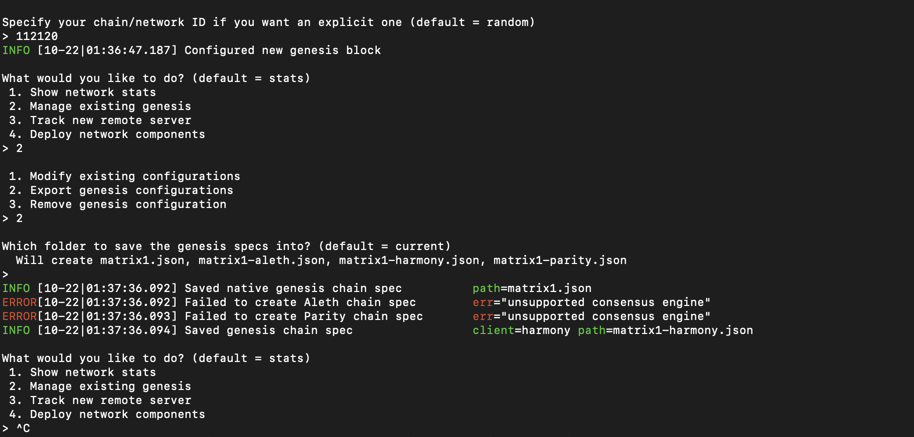
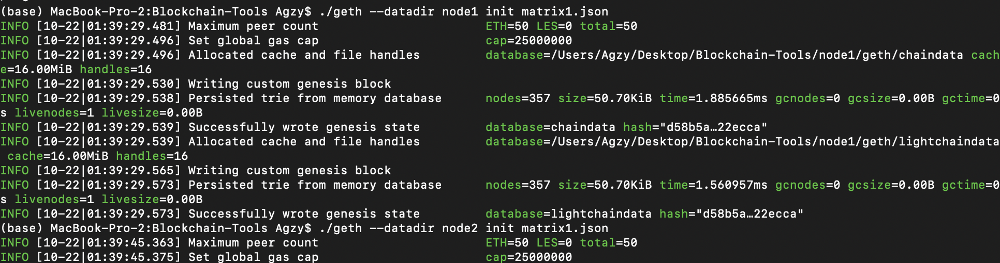
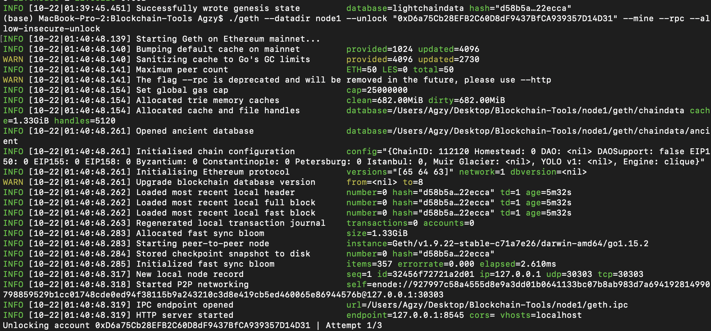
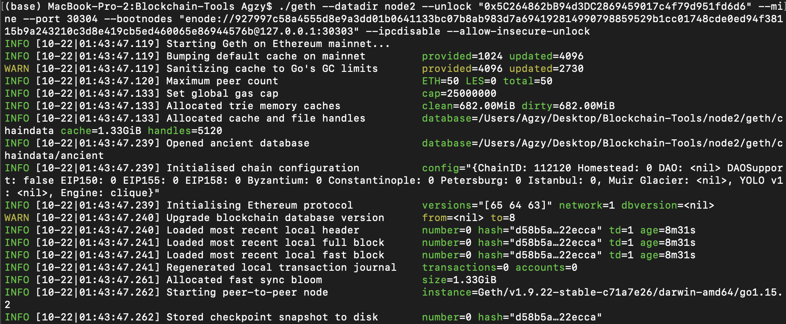

# Blockchain-Homework

Creating of Proof of Authority (PoA) algorithm required to create accounts for two nodes

* Once two nodes have been created, then we run the puppeth

* Chose the Clique - Proof of Authority consensus algorithm

* Copied the addresses for the new accounts created for two nodes

* Also, pre-fund both the accounts created

* After the prefunding, new chain id is created with name 112120

* Then, I exported the existing genesis and saved the genesis specs

* Open geth and initialise both the nodes

* Run one Node in separate Terminal window

* Run the second Node in separate Terminal window

### Adding Blockchain to MyCrypto:

